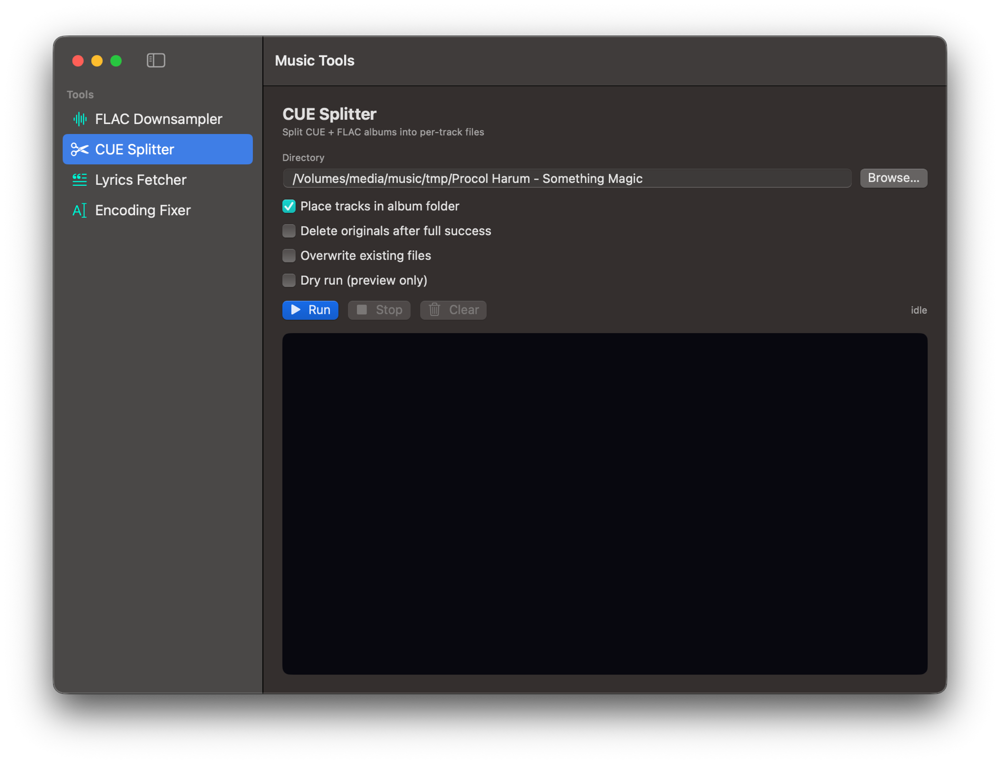

# Music Tools

A native macOS app for tidying up a music library — downsampling FLACs, splitting CUE albums, fetching lyrics, and repairing mis-encoded cue sheets. Built in pure SwiftUI for Apple Silicon, with **ffmpeg as its only external dependency**. No bundled Python, Node, or Perl.

It started as a pile of shell/Python/Perl scripts and a small web UI. This is the rewrite: every tool is now native Swift, each runs in-process, streams its output to a live console, shows real progress, and can be cancelled mid-run.



---

## Tools

| Tool | What it does |
| --- | --- |
| **FLAC Downsampler** | Re-encodes FLACs to 44.1 kHz / 16-bit. Skips anything already at (or below) CD quality. |
| **CUE Splitter** | Splits a `CUE` + single-FLAC album into per-track FLACs, with full tag metadata. |
| **Lyrics Fetcher** | Finds and saves lyrics (`.lrc` / `.txt`) for a folder of audio files. |
| **Encoding Fixer** | Repairs mis-encoded `.cue` files (Windows-1251 / mojibake → UTF-8). |

### FLAC Downsampler

Walks a directory for `.flac` files and converts each to 44.1 kHz / 16-bit (`-compression_level 8`). Files already at or below that are detected via `ffprobe` and skipped, so re-running over a mixed folder only touches what needs touching.

- **Replace mode** rewrites originals in place — but every encode is staged in a **local temp directory first**, then copied back. The source volume only ever sees a sequential read followed by a single write, never a simultaneous read+write burst. This matters on network shares (SMB/NFS), where a sustained concurrent read+write can stall the mount. The copy-back is atomic (write-beside-then-swap), so a failed copy never leaves a half-written original.
- **Output mode** writes converted files to a chosen folder (or a `downsampled/` subfolder), leaving originals untouched.
- Progress is driven by ffmpeg's own `-progress` output, so the bar reflects real per-file encode position.

### CUE Splitter

Recursively finds `.cue` sheets and splits each `CUE` + FLAC album into individual tracks.

- **Robust encoding handling** — cue sheets are decoded by trying UTF-8 → Windows-1251 → Latin-1, so Cyrillic and other non-UTF-8 sheets parse correctly.
- **Filesystem-aware** — resolves the referenced audio file by Unicode normalization (handles macOS NFD vs. NFC filename mismatches).
- **Full metadata** — each track gets `TITLE`, `TRACK`, `ARTIST`, `ALBUM`, `ALBUM_ARTIST`, `DATE`, and `GENRE` from the sheet.
- **Safe by construction** — tracks are written to a staging area and only moved into place once the *whole* album succeeds; a partial failure leaves no stray files. Existing files are uniquified (` (1)`, ` (2)`, …) unless **Overwrite** is set.
- **Options** — place tracks in the album folder or a `split/` subfolder, optionally delete the original FLAC + cue after a fully successful split, and a **Dry run** that previews every track and time boundary without writing anything.

### Lyrics Fetcher

Walks a directory for audio files (`flac`, `mp3`, `m4a`) and fetches lyrics from, in order, **LRCLIB → ChartLyrics → lyrics.ovh**.

- **Native tag reading**, no external library: FLAC artist/title are parsed directly from the Vorbis comment block; MP3/M4A via AVFoundation.
- Synced lyrics are saved as `.lrc`, plain lyrics as `.txt`, alongside each track. Existing sidecars are skipped unless **Overwrite** is set; **Prefer text** forces plain over synced.
- Concurrent fetching with a configurable worker count and pacing delay, plus retry/back-off on rate limits.

### Encoding Fixer

Recursively finds `.cue` files and repairs ones written in the wrong encoding.

Rather than guessing what went wrong, it produces every plausible reading of the raw bytes — straight UTF-8, raw Windows-1251, and the classic "cp1251 decoded as Latin-1 then stored as UTF-8" double-encode — scores each on how much looks like real text versus decode-junk, and keeps the best. Files already in clean UTF-8 are left alone.

- **Dry run by default** — previews each file it would fix, the encoding it detected, and a sample of the recovered text. Nothing is written until you enable **Apply**.
- Optional `.bak` backups before rewriting.

---

## Design notes

- **One dependency.** The only external binaries are `ffmpeg` and `ffprobe`. Everything else — directory walking, tag reading, HTTP, XML/JSON parsing, byte-level encoding work — is native Swift / Foundation.
- **In-process, cancellable jobs.** Each tool runs as an async task that streams log lines and progress into a shared console UI. **Stop** cancels the task and force-terminates any running ffmpeg.
- **Apple Silicon only.** arm64, no Rosetta. Targets macOS 13+.
- **Last-used paths** are remembered per tool; destructive toggles (Replace, Delete) are deliberately never persisted.

---

## Requirements

- **macOS 13 (Ventura) or later**, Apple Silicon.
- **Swift toolchain** — Xcode or the Command Line Tools (`xcode-select --install`).
- **ffmpeg / ffprobe** on your `PATH` for development and the beta build (`brew install ffmpeg`). The distributable build bundles them.
- **Node / npm** *only* for the distributable build, which uses it to fetch static ffmpeg binaries (see below). Not needed otherwise.

---

## Build & run

### Develop

Runs directly against your system ffmpeg, no packaging:

```sh
swift run
```

### Beta app (local use)

Produces `build/MusicTools.app` that relies on your system/Homebrew ffmpeg. Fast; good for everyday use on your own machine.

```sh
./scripts/build_app.sh
open build/MusicTools.app          # first launch: right-click → Open
```

### Distributable app (self-contained)

Produces an arm64 `build/MusicTools.app` with `ffmpeg`/`ffprobe` bundled inside, suitable for handing to another Mac. By default this **downloads** static ffmpeg binaries via npm (`ffmpeg-ffprobe-static`):

```sh
./scripts/build_dist.sh
```

To make a DMG:

```sh
./scripts/package_dmg.sh           # → build/MusicTools.dmg
```

### Signing

Both build scripts ad-hoc sign by default — recipients clear the quarantine flag on first launch (right-click → Open, or `xattr -dr com.apple.quarantine MusicTools.app`).

For a Developer ID signed + notarized build, set:

```sh
export DEV_ID="Developer ID Application: Your Name (TEAMID)"
export NOTARY_PROFILE="your-notarytool-profile"   # used by package_dmg.sh
./scripts/build_dist.sh
./scripts/package_dmg.sh
```

### Vendoring ffmpeg (offline / trusted builds)

The dist build fetches `ffmpeg-ffprobe-static` from npm each time, which (a) requires network and (b) ships third-party binaries. To build offline — or to ship ffmpeg from a source you control — drop your own arm64 static `ffmpeg` and `ffprobe` into:

```
build/MusicTools.app/Contents/Resources/vendor/bin/arm64/
```

and replace the npm step in `build_dist.sh` with a copy from wherever you keep them. The app resolves ffmpeg from that bundled location first, then falls back to Homebrew (`/opt/homebrew/bin`) and the system path.

---

## Project layout

```
MusicToolsNative/
├── Package.swift
├── Info.plist
├── MusicTools.entitlements
├── README.md
├── Sources/MusicToolsNative/
│   ├── MusicToolsApp.swift       # @main, theme, quit cleanup
│   ├── ContentView.swift         # sidebar + tool routing
│   ├── Tool.swift                # tool enum
│   ├── Panels.swift              # the four tool panels (UI + options)
│   ├── Components.swift          # console, path fields, scaffold
│   ├── ToolRunner.swift          # job lifecycle, console buffering, progress, cancel
│   ├── Subprocess.swift          # async, cancellable ffmpeg/ffprobe runner
│   ├── Paths.swift               # ffmpeg resolution + environment
│   ├── TagReader.swift           # native FLAC / MP3 / M4A tag reading
│   ├── FlacDownsampler.swift     # FLAC Downsampler
│   ├── CueSplitter.swift         # CUE Splitter
│   ├── LyricsFetcher.swift       # Lyrics Fetcher
│   └── EncodingFixer.swift       # Encoding Fixer (.cue mojibake repair)
└── scripts/
    ├── build_app.sh              # beta build (system ffmpeg)
    ├── build_dist.sh             # self-contained build (bundles ffmpeg)
    └── package_dmg.sh            # DMG packaging + optional notarization
```

---

## License

Add your license of choice here.
